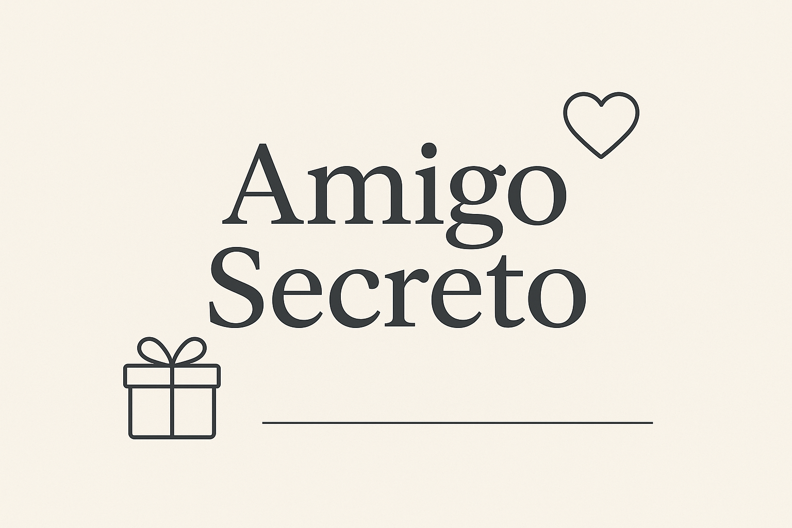

# 🎁 Amigo Secreto

---

## 🏅 Insignias

---

## 📑 Índice
- [Descripción del Proyecto](#-descripción-del-proyecto)
- [Estado del proyecto](#-estado-del-proyecto)
- [Demostración de funciones y aplicaciones](#-demostración-de-funciones-y-aplicaciones)
- [Acceso al Proyecto](#-acceso-al-proyecto)
- [Tecnologías utilizadas](#-tecnologías-utilizadas)
- [Personas Contribuyentes](#-personas-contribuyentes)
- [Personas Desarrolladoras del Proyecto](#-personas-desarrolladoras-del-proyecto)

---

## 📖 Descripción del Proyecto
El Juego Amigo Secreto es una aplicación web sencilla y divertida, creada con HTML, CSS y JavaScript, que permite practicar conceptos básicos de desarrollo frontend.

El funcionamiento es muy simple:

Los usuarios pueden ir añadiendo nombres de amigos a una lista.

La lista se va mostrando en pantalla a medida que se agregan los nombres.

Solo se permiten nombres válidos (sin números).

Una vez creada la lista, se puede realizar un sorteo aleatorio para seleccionar a un “Amigo Secreto”, que se mostrará debajo de la lista.

Este proyecto tiene como objetivo reforzar habilidades en el manejo del DOM, validaciones, eventos y estilos, aplicados en un reto entretenido y fácil de implementar.

---

## 🚀 Estado del proyecto
✅ Proyecto funcional  
📌 Futuras mejoras

---

## 🎥 Demostración de funciones y aplicaciones

---

## 🔑 Acceso al Proyecto
Clona el repositorio desde GitHub:

---

## 🛠 Tecnologías utilizadas

HTML5 → estructura del proyecto.

CSS3 → estilos y diseño visual.

JavaScript (Vanilla JS) → lógica de negocio y manipulación del DOM.

---

## 🙌 Personas Contribuyentes

Andrea AG (documentación y modificación del proyecto).

Alura Latam (Proyecto base).

---

## 👩‍💻 Personas Desarrolladoras del Proyecto

Andrea AG

